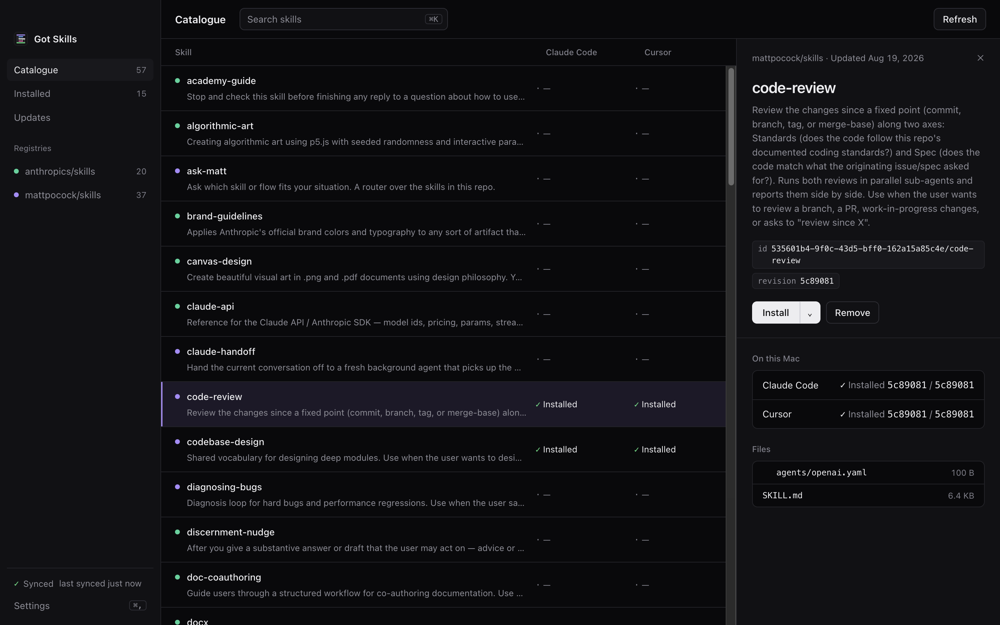
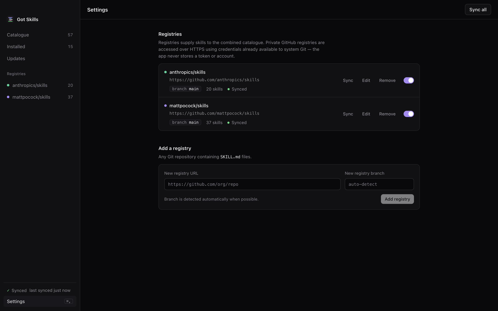

<h1> Got Skills</h1>

**The easy way to manage your AI agent's skills.**

A macOS app for browsing, installing, and updating agent skills for any agent [skills.sh](https://skills.sh) supports, including Claude Code, Cursor, Codex, Goose and many more. No command line needed.



_Every skill from every registry in one table, showing whether each agent has it installed._



_Add any Git repository as a registry. Public and private GitHub repos both work._

---

## Features

- **One catalogue, many registries.** Add your own, your team's, or a public
  skill repository and browse them all together. Filter by registry, or by what's
  installed or out of date.
- **Install to any agent skills.sh supports.** Got Skills detects the agents on
  your Mac and installs a copy into each agent's skills folder. Agents without a
  folder of their own, such as Cursor and Codex, share one folder,
  `~/.agents/skills`, so a single install there reaches them all. Install to one
  folder or to all of them in one click. Settings lists every supported agent,
  its folder and whether it's detected.
- **Updates in one go.** The Updates view lists out-of-date skills and updates
  them all at once.
- **Private registries.** Uses the credentials system Git already has. The app
  never stores a token or account.
- **Works offline.** The app keeps the last good sync of each registry, so you
  can still install skills when a sync fails.
- **Nothing gets overwritten.** If two registries ship a skill with the same name, or
  a skill already exists outside the app, Got Skills tells you instead of replacing it.

## Get the app

Download the latest `.dmg` from
**[Releases](https://github.com/joshystuart/gotskills/releases)**, open it,
and drag **Got Skills** to your Applications folder. Choose the `arm64` DMG
for Apple Silicon (M1 and later), or the `x64` DMG for Intel.

---

## For developers

Requires **macOS** and **Node.js 24+**.

```bash
cd app
npm ci
npm run dev          # run with hot reload
```

| Command                 | Output                                                                              |
| ----------------------- | ----------------------------------------------------------------------------------- |
| `npm run build`         | Unsigned arm64 and x64 DMGs (local verify only; Gatekeeper blocks it on other Macs) |
| `npm run build:release` | Signed + notarized arm64 and x64 DMGs (needs Apple credentials)                     |
| `npm run package:dir`   | Unsigned `.app` in `dist/mac-arm64/` (fast; used by CI on PRs)                      |
| `npm run typecheck`     | Type-check without emitting                                                         |
| `npm test`              | Run the test suite                                                                  |

The domain vocabulary (registries, snapshots, conflicts, collisions, skill
identity) is documented in [CONTEXT.md](CONTEXT.md) and [docs/adr/](docs/adr).

---

## License

[MIT](LICENSE) © Josh Stuart
